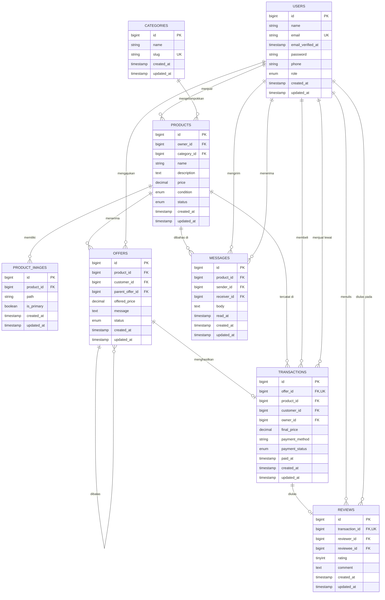

# P01 - Database Design: PRELOVED MARKET

**Marketplace Barang Bekas Multi-Seller**

|||
|-|-|
|**Nama**|Muhammad Ridho Jan Muhani|
|**NPM**|2410010567|
|**Kelas**|5C TI Reg BJB|
|**Mata Kuliah**|PBO2 (Laravel)|
|**Fase**|P01 - Database Design|
|**Job**|J1 - Entity Relationship Diagram dan dokumentasi|
|**Status**|✅ Done|
|**Branch**|`feature/database-design`|
|**Pull Request**|https://github.com/mirzayogy/laravel5d/pull/1|

\---

## 1\. Deskripsi Sistem

**PRELOVED MARKET** adalah platform marketplace (perantara) jual beli barang bekas berbasis web yang menampung banyak penjual (*multi-seller*) dalam satu aplikasi. Setiap penjual dapat mengunggah barang bekas miliknya, sedangkan pembeli dapat mencari barang, berdiskusi dengan penjual, mengajukan tawaran harga, dan membayar apabila tawaran disetujui. Harga pada platform ini bersifat dapat dinegosiasikan, sehingga proses tawar-menawar menjadi bagian inti dari sistem.

Terdapat tiga aktor dalam sistem. **Admin** bertugas mengelola pengguna, kategori, serta memoderasi produk yang melanggar ketentuan. **Owner** adalah penjual atau pemilik barang yang mengunggah produk, menanggapi tawaran dari pembeli (menyetujui, menolak, atau mengajukan penawaran balik), dan menerima pembayaran. **Customer** adalah pembeli yang mencari produk, mengajukan tawaran, melakukan pembayaran, dan memberikan ulasan setelah transaksi selesai.

Alur utama sistem adalah **cari → pilih → tawar → setujui → bayar**. Customer mencari barang berdasarkan kata kunci atau kategori, memilih produk yang diminati, lalu mengajukan tawaran harga. Owner dapat menyetujui, menolak, atau membalas dengan penawaran balik (*counter-offer*). Ketika sebuah tawaran disetujui, sistem membuat transaksi secara otomatis, kemudian customer melakukan pembayaran. Setelah pembayaran selesai, kedua pihak dapat saling memberikan ulasan.

\---

## 2\. Daftar Entitas

Seluruh tabel memiliki kolom `created_at` dan `updated_at` (*timestamps*) sesuai konvensi Laravel.

### 2.1 USERS

|Atribut|Tipe Data|Keterangan|
|-|-|-|
|id|bigint (PK)|Identitas unik pengguna|
|name|string|Nama lengkap|
|email|string (UK)|Email, unik|
|email_verified_at|timestamp, nullable|Waktu verifikasi email|
|password|string|Kata sandi ter-*hash*|
|phone|string, nullable|Nomor telepon|
|role|enum (`admin`, `owner`, `customer`)|Peran pengguna|
|created_at, updated_at|timestamp|*Timestamps*|

### 2.2 CATEGORIES

|Atribut|Tipe Data|Keterangan|
|-|-|-|
|id|bigint (PK)|Identitas unik kategori|
|name|string|Nama kategori|
|slug|string (UK)|Penanda URL, unik|
|created_at, updated_at|timestamp|*Timestamps*|

### 2.3 PRODUCTS

|Atribut|Tipe Data|Keterangan|
|-|-|-|
|id|bigint (PK)|Identitas unik produk|
|owner_id|bigint (FK → users.id)|Pemilik/penjual barang|
|category_id|bigint (FK → categories.id)|Kategori produk|
|name|string|Nama produk|
|description|text|Deskripsi dan kondisi barang|
|price|decimal(12,2)|Harga awal yang diminta penjual|
|condition|enum (`like_new`, `good`, `fair`)|Kondisi barang|
|status|enum (`available`, `reserved`, `sold`)|Status ketersediaan|
|created_at, updated_at|timestamp|*Timestamps*|

### 2.4 PRODUCT_IMAGES

|Atribut|Tipe Data|Keterangan|
|-|-|-|
|id|bigint (PK)|Identitas unik gambar|
|product_id|bigint (FK → products.id)|Produk pemilik gambar|
|path|string|Lokasi berkas gambar|
|is_primary|boolean|Penanda gambar utama|
|created_at, updated_at|timestamp|*Timestamps*|

### 2.5 OFFERS

|Atribut|Tipe Data|Keterangan|
|-|-|-|
|id|bigint (PK)|Identitas unik tawaran|
|product_id|bigint (FK → products.id)|Produk yang ditawar|
|customer_id|bigint (FK → users.id)|Pembeli yang menawar|
|parent_offer_id|bigint (FK → offers.id), nullable|Tawaran yang dibalas (untuk *counter-offer*)|
|offered_price|decimal(12,2)|Harga yang ditawarkan|
|message|text, nullable|Pesan pendamping|
|status|enum (`pending`, `countered`, `accepted`, `rejected`, `cancelled`)|Status tawaran|
|created_at, updated_at|timestamp|*Timestamps*|

### 2.6 TRANSACTIONS

|Atribut|Tipe Data|Keterangan|
|-|-|-|
|id|bigint (PK)|Identitas unik transaksi|
|offer_id|bigint (FK → offers.id, UK)|Tawaran yang disetujui|
|product_id|bigint (FK → products.id)|Produk yang dibeli|
|customer_id|bigint (FK → users.id)|Pembeli|
|owner_id|bigint (FK → users.id)|Penjual|
|final_price|decimal(12,2)|Harga akhir kesepakatan|
|payment_method|string|Metode pembayaran|
|payment_status|enum (`unpaid`, `paid`, `failed`, `refunded`)|Status pembayaran|
|paid_at|timestamp, nullable|Waktu pembayaran|
|created_at, updated_at|timestamp|*Timestamps*|

### 2.7 MESSAGES

|Atribut|Tipe Data|Keterangan|
|-|-|-|
|id|bigint (PK)|Identitas unik pesan|
|product_id|bigint (FK → products.id)|Produk yang menjadi topik chat|
|sender_id|bigint (FK → users.id)|Pengirim pesan|
|receiver_id|bigint (FK → users.id)|Penerima pesan|
|body|text|Isi pesan|
|read_at|timestamp, nullable|Waktu pesan dibaca|
|created_at, updated_at|timestamp|*Timestamps*|

### 2.8 REVIEWS

|Atribut|Tipe Data|Keterangan|
|-|-|-|
|id|bigint (PK)|Identitas unik ulasan|
|transaction_id|bigint (FK → transactions.id, UK)|Transaksi yang diulas|
|reviewer_id|bigint (FK → users.id)|Pemberi ulasan|
|reviewee_id|bigint (FK → users.id)|Pihak yang diulas|
|rating|tinyint (1-5)|Nilai ulasan|
|comment|text, nullable|Komentar|
|created_at, updated_at|timestamp|*Timestamps*|

\---

## 3\. Relasi Antar Entitas

|Dari|Ke|Tipe Relasi|Keterangan|Eloquent|
|-|-|-|-|-|
|USERS|PRODUCTS|1 — N|Satu owner dapat menjual banyak produk|`hasMany` / `belongsTo`|
|CATEGORIES|PRODUCTS|1 — N|Satu kategori memuat banyak produk|`hasMany` / `belongsTo`|
|PRODUCTS|PRODUCT_IMAGES|1 — N|Satu produk memiliki banyak gambar|`hasMany` / `belongsTo`|
|PRODUCTS|OFFERS|1 — N|Satu produk dapat menerima banyak tawaran|`hasMany` / `belongsTo`|
|USERS|OFFERS|1 — N|Satu customer dapat mengajukan banyak tawaran|`hasMany` / `belongsTo`|
|OFFERS|OFFERS|1 — N (self)|Satu tawaran dapat dibalas dengan banyak penawaran balik berantai|`hasMany` / `belongsTo`|
|OFFERS|TRANSACTIONS|1 — 1|Satu tawaran yang disetujui menghasilkan satu transaksi|`hasOne` / `belongsTo`|
|PRODUCTS|TRANSACTIONS|1 — N|Satu produk dapat tercatat pada transaksi (misalnya jika transaksi sebelumnya gagal)|`hasMany` / `belongsTo`|
|USERS (customer)|TRANSACTIONS|1 — N|Satu customer dapat melakukan banyak pembelian|`hasMany` / `belongsTo`|
|USERS (owner)|TRANSACTIONS|1 — N|Satu owner dapat memiliki banyak penjualan|`hasMany` / `belongsTo`|
|TRANSACTIONS|REVIEWS|1 — 1|Satu transaksi menghasilkan satu ulasan|`hasOne` / `belongsTo`|
|USERS (reviewer)|REVIEWS|1 — N|Satu pengguna dapat menulis banyak ulasan|`hasMany` / `belongsTo`|
|USERS (reviewee)|REVIEWS|1 — N|Satu pengguna dapat menerima banyak ulasan|`hasMany` / `belongsTo`|
|PRODUCTS|MESSAGES|1 — N|Satu produk memiliki banyak pesan diskusi|`hasMany` / `belongsTo`|
|USERS (sender)|MESSAGES|1 — N|Satu pengguna dapat mengirim banyak pesan|`hasMany` / `belongsTo`|
|USERS (receiver)|MESSAGES|1 — N|Satu pengguna dapat menerima banyak pesan|`hasMany` / `belongsTo`|

\---

## 4\. Entity Relationship Diagram

\---

## 5\. Penjelasan Relasi

1. **USERS → PRODUCTS (1 — N):** Setiap produk dimiliki oleh satu pengguna berperan owner melalui `owner_id`, dan satu owner dapat memiliki banyak produk.
2. **CATEGORIES → PRODUCTS (1 — N):** Setiap produk termasuk dalam satu kategori melalui `category_id` untuk memudahkan pencarian.
3. **PRODUCTS → PRODUCT_IMAGES (1 — N):** Satu produk dapat memiliki beberapa foto, dengan satu foto ditandai sebagai gambar utama.
4. **PRODUCTS → OFFERS (1 — N):** Setiap tawaran merujuk ke satu produk, dan satu produk dapat menerima tawaran dari banyak customer.
5. **USERS → OFFERS (1 — N):** Setiap tawaran diajukan oleh satu customer melalui `customer_id`, dan satu customer dapat menawar banyak produk.
6. **OFFERS → OFFERS (1 — N, self-reference):** Kolom `parent_offer_id` menghubungkan penawaran balik dengan tawaran sebelumnya sehingga riwayat tawar-menawar bertingkat dapat ditelusuri.
7. **OFFERS → TRANSACTIONS (1 — 1):** Hanya tawaran berstatus `accepted` yang menghasilkan transaksi, dan kolom `offer_id` bersifat unik agar satu tawaran tidak menghasilkan transaksi ganda.
8. **PRODUCTS → TRANSACTIONS (1 — N):** Transaksi mencatat produk yang dibeli; satu produk dapat memiliki lebih dari satu transaksi, misalnya bila transaksi sebelumnya gagal atau dibatalkan.
9. **USERS (customer) → TRANSACTIONS (1 — N):** Kolom `customer_id` mencatat pembeli pada setiap transaksi.
10. **USERS (owner) → TRANSACTIONS (1 — N):** Kolom `owner_id` mencatat penjual pada setiap transaksi sehingga riwayat penjualan owner mudah dihitung.
11. **TRANSACTIONS → REVIEWS (1 — 1):** Ulasan hanya dapat dibuat setelah transaksi selesai, dengan satu ulasan untuk setiap transaksi.
12. **USERS (reviewer) → REVIEWS (1 — N):** `reviewer_id` mengidentifikasi pengguna yang menulis ulasan.
13. **USERS (reviewee) → REVIEWS (1 — N):** `reviewee_id` mengidentifikasi pengguna yang menerima ulasan, sehingga reputasi penjual maupun pembeli dapat dihitung.
14. **PRODUCTS → MESSAGES (1 — N):** Setiap pesan terikat pada satu produk, sehingga diskusi pembeli dan penjual terkumpul per produk.
15. **USERS (sender) → MESSAGES (1 — N):** `sender_id` mencatat pengguna yang mengirim pesan.
16. **USERS (receiver) → MESSAGES (1 — N):** `receiver_id` mencatat pengguna yang menerima pesan.

\---

## 6\. Catatan Desain

* **Batasan unik (*unique constraint*):** `users.email`, `categories.slug`, `transactions.offer_id`, dan `reviews.transaction_id`, sehingga satu tawaran hanya menghasilkan satu transaksi dan satu transaksi hanya memiliki satu ulasan.
* **Counter-offer:** Penawaran balik disimpan sebagai baris baru pada `offers` dengan `parent_offer_id` yang menunjuk ke tawaran sebelumnya, bukan dengan mengubah harga pada tawaran awal, agar riwayat negosiasi tetap utuh.
* **Pembuatan transaksi otomatis:** Saat status tawaran berubah menjadi `accepted`, sistem membuat baris `transactions` dan mengubah status produk menjadi `reserved`; setelah pembayaran berhasil, status produk menjadi `sold`.
* **Aturan penghapusan:** Menghapus pengguna atau produk dibatasi (*restrict*) apabila sudah memiliki transaksi; gambar produk dan pesan terkait ikut terhapus (*cascade*) bersama produk.
* **Peran pengguna:** Peran disimpan pada kolom `role` di `users`, sehingga tidak diperlukan tabel terpisah untuk admin, owner, dan customer.
* **Data awal (*seeder*):** Tabel `categories` diisi lima kategori bawaan.

|Nama|Slug|
|-|-|
|Elektronik|`elektronik`|
|Fashion|`fashion`|
|Buku|`buku`|
|Furnitur|`furnitur`|
|Lainnya|`lainnya`|

\---

## 7\. Bukti dan Cara Verifikasi

* **Bukti:** https://github.com/KEDAIBACOT/laravel5C/blob/feature/database-design/docs/progress/P01-database-design.md, https://github.com/KEDAIBACOT/laravel5C/commit/27e1159
* **Verifikasi:** jalankan `php artisan migrate:fresh --seed` dan pastikan tidak ada galat.
* **Belum dikerjakan:** pembuatan *migration*, *model*, dan *seeder* (fase berikutnya).

